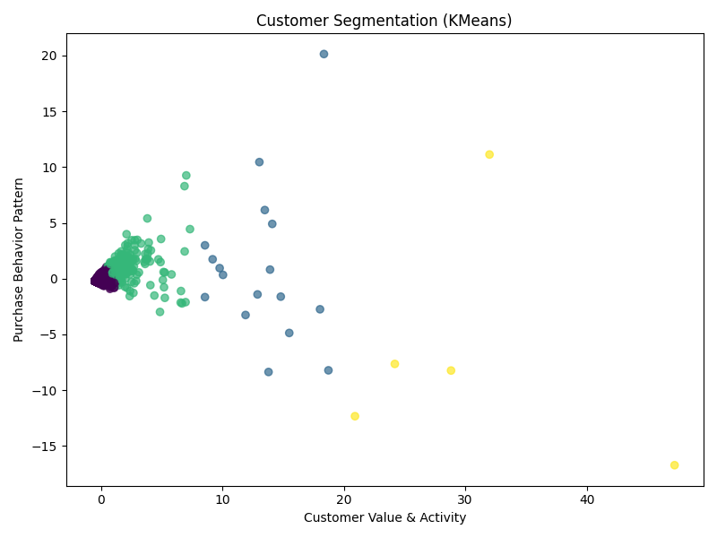

# 🤖 Customer Segmentation with Machine Learning

This project applies **KMeans clustering** to segment customers based on purchasing behavior.

---

## 🎯 Objective

Identify different types of customers using transactional data and uncover behavioral patterns.

---

## 🧠 Approach

The analysis follows these steps:

1. Data cleaning (removing invalid transactions)
2. Feature engineering (customer-level metrics)
3. Data normalization
4. KMeans clustering
5. Dimensionality reduction (PCA) for visualization

---

## 📊 Features Used

* TotalRevenue → total amount spent
* NumPurchases → purchase frequency
* TotalQuantity → total items purchased

---

## 📈 Customer Segmentation

Each point represents a customer, and colors indicate different clusters identified by the model.

---

## 🔍 Key Insights

* A small group of customers generates a large portion of revenue
* Most customers fall into low or medium value segments
* High-value customers behave differently and form distinct clusters
* The distribution suggests a typical Pareto pattern (80/20 rule)

---

## 🛠️ Tools & Technologies

* Python
* Pandas
* Scikit-learn
* Matplotlib

---

## 🧠 What I Learned

* How to apply clustering to real-world data
* The importance of feature engineering
* Handling scale differences using normalization
* Using PCA for dimensionality reduction and visualization

---

## 🔗 Author

Dilson Cassaro
